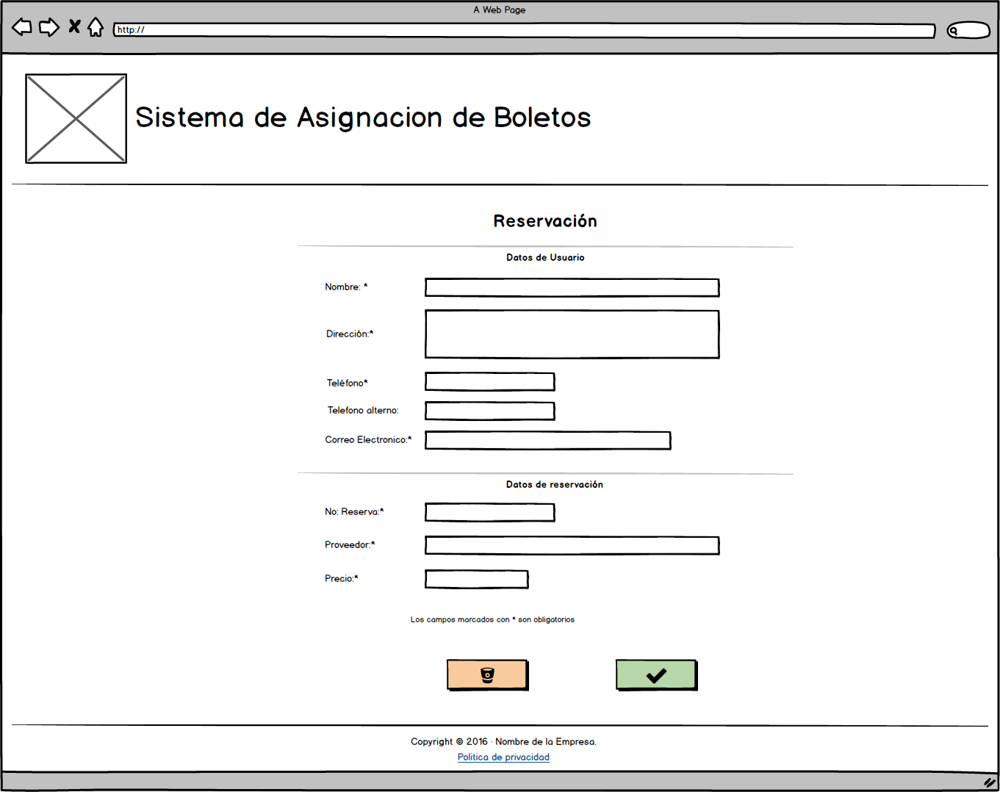
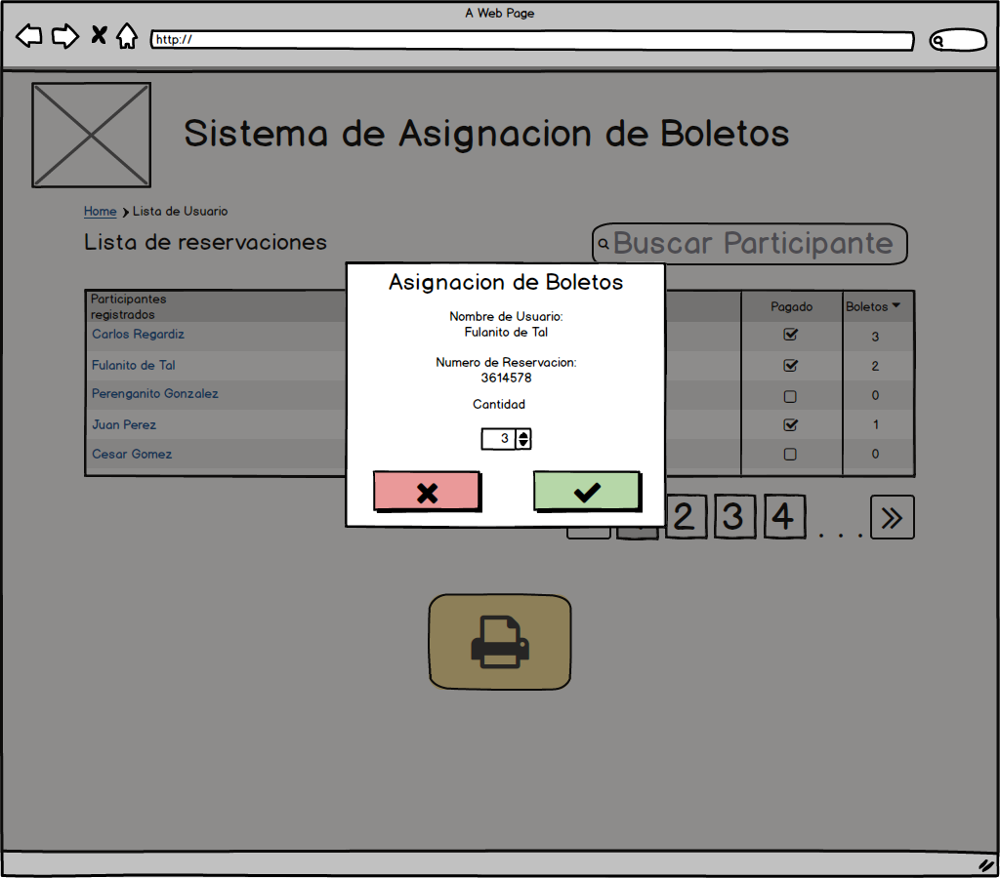
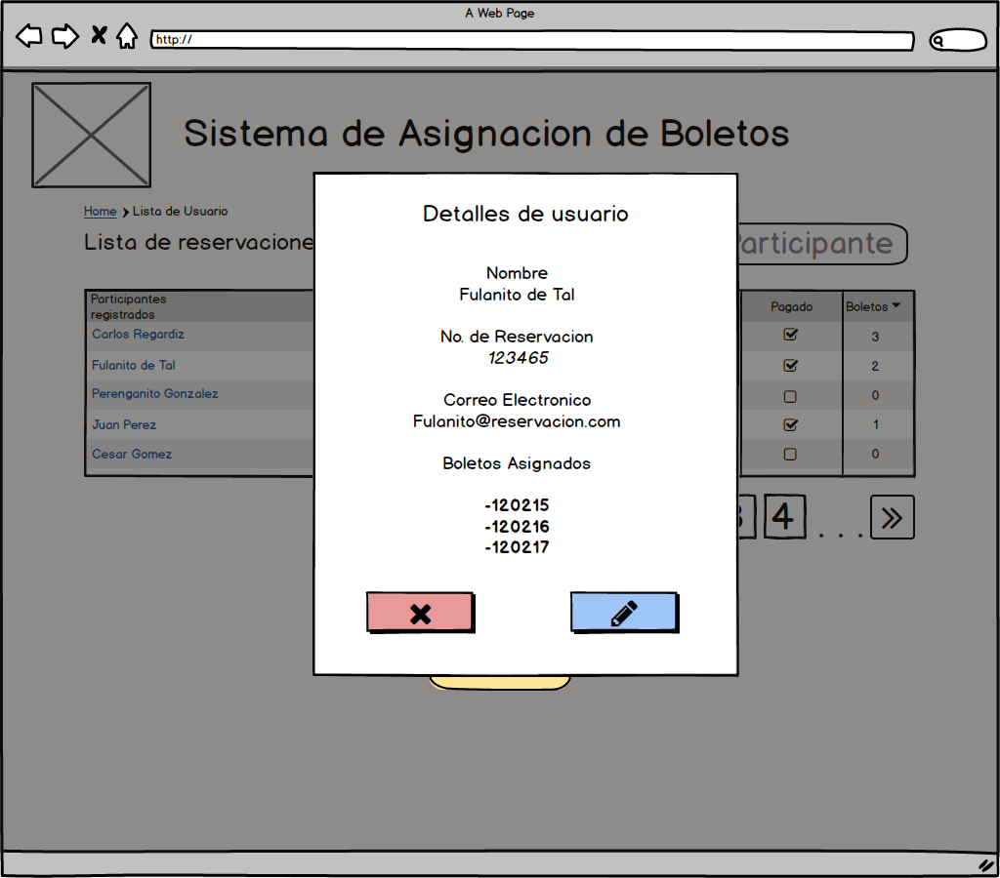
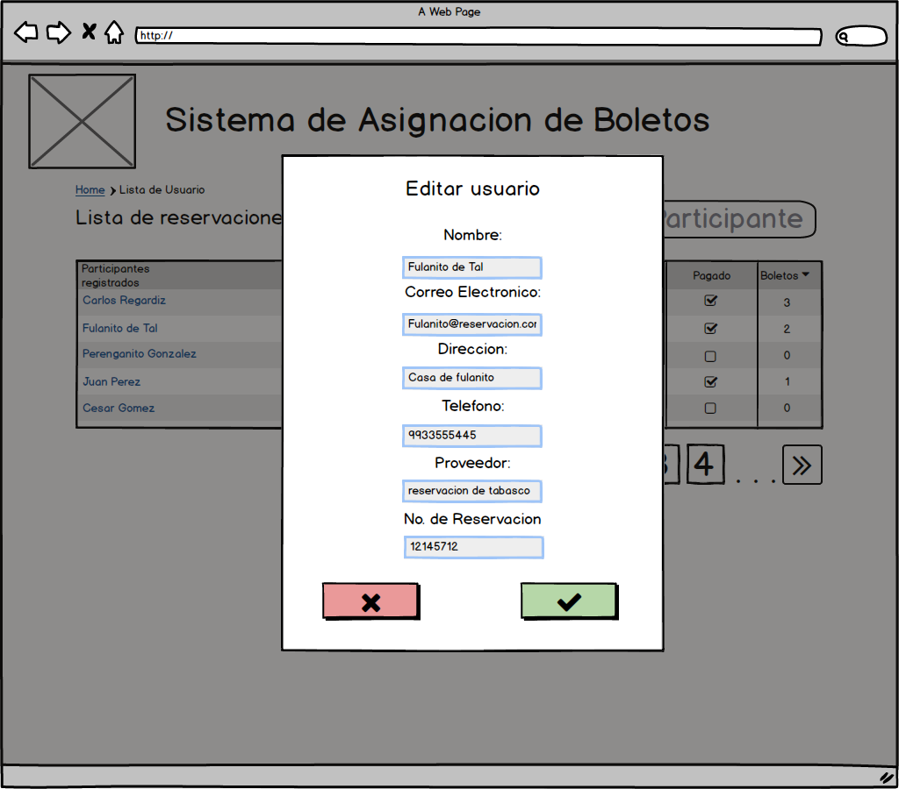

# Sistema de Asignacion de Boletos
An React online contest application

Flujo de Trabajo para la asignacion de boletos de rifa a usuarios que han reservado con la empresa.

- [ ] El asesor de ventas debe realizar el registro de cada usuario que ha reservado previamente.
- [ ] El asesor de ventas puede ver la lista de usuarios registrados.
- [ ] El asesor de ventas puede confirmar que los usuarios han realizado el pago de la reservacion.
- [ ] El asesor de ventas puede asignar la cantidad de boletos que se le dara a la usuario que ya han pagado la reservacion
- [ ] El asesor de ventas puede enviar un correo electronico de confimacion a cada usuario, detallando en este correo electronico los boletos asignados
- [ ] El asesor de ventas puede imprimir todos los boletos asignados con los datos de cada usuario.
- [ ] El asesor de ventas puede generar una busqueda de datos de los clientes con los boletos asignados.
- [ ] El asesor de venta puede ver los detalles de cada usuario
- [ ] El asesor de venta puede editar datos de cada usuario

### Mapa de sitio

### Home

Formulario para registro de usuario

### Lista de usuarios registrados

Lista en forma de tabla con informacion basica del usuario, cuenta con barra de busqueda;
cuenta con un boton para imprimir todos los boletos asignados; en la linea de usuario al dar clic en el nombre de cada usuario pasamos al modal de detalles de usuario; cada linea de usuario muestra un check editable para activar si el usuario ya realizo el pago, al activar pasamos al modal de asignacion de boletos.

### Asignacion de boletos por usuario

Modal que muestra la asignacion de boletos por usuario, al enviar los datos automaticamente se envia un correo electronico al usuario con informacion de los boletos asignados.

###  Detalles de usuario

Modal que muestra lo detalles de usuario, cuenta con boton para editar.

###  Editar usuario

Modal para editar datos de usuario
